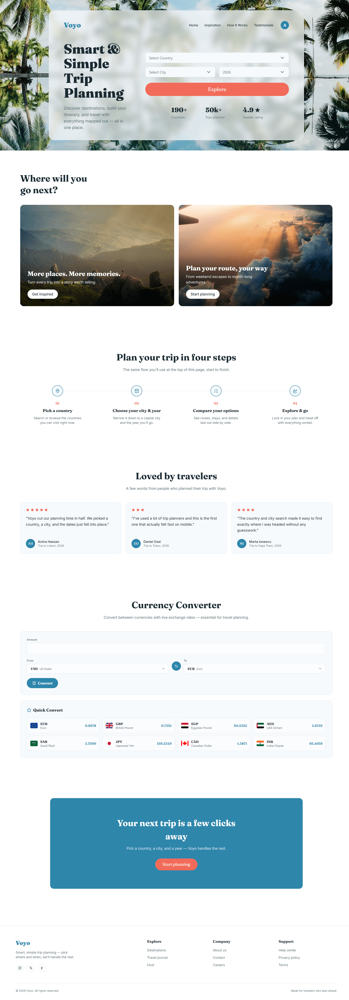
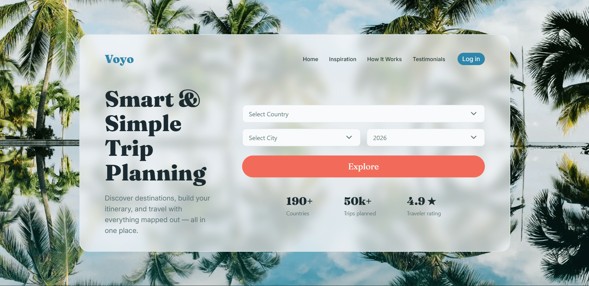
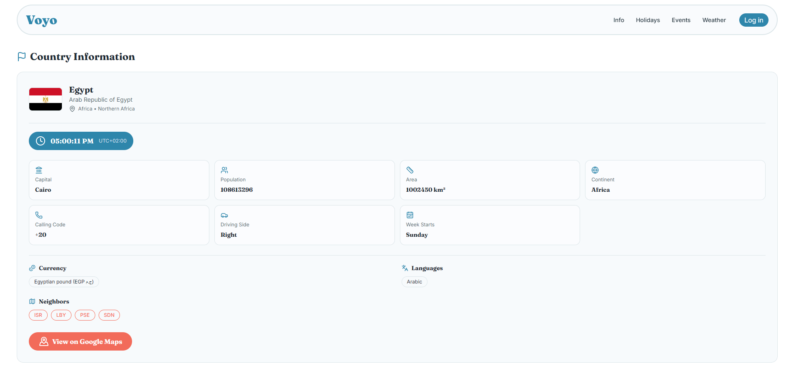
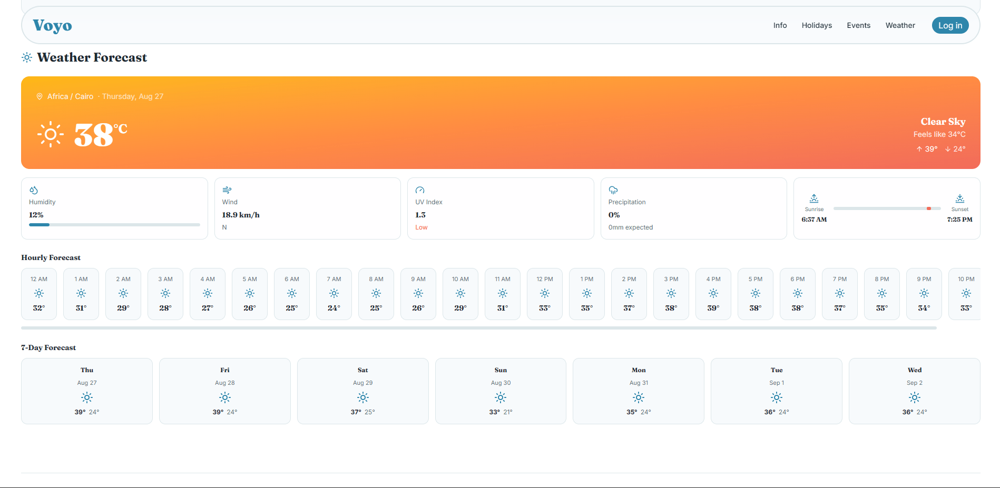
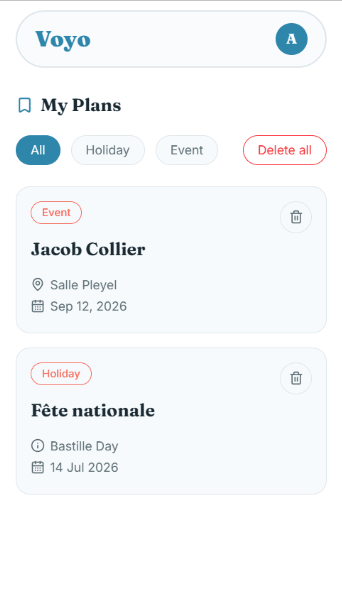
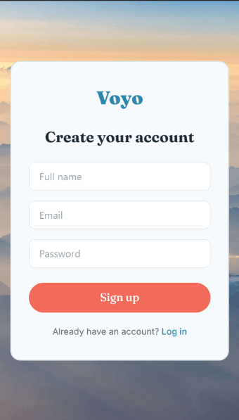

# Voyo

Voyo is a trip-planning web app that lets you search for a country, explore practical travel information — local time, currency, languages, public holidays, local events, and a live weather forecast — and save the ones you like to a personal "My Plans" dashboard.

**Live demo:** https://voyo-planner.vercel.app



---

## Table of Contents

- [Features](#features)
- [Screenshots](#screenshots)
- [Tech Stack](#tech-stack)
- [Project Structure](#project-structure)
- [Getting Started](#getting-started)
- [Environment Variables](#environment-variables)
- [Available Scripts](#available-scripts)
- [Routes](#routes)
- [Known Limitations](#known-limitations)
- [Author](#author)

---

## Features

- 🔍 **Destination search** — pick a country, city, and year to build a personalized trip overview
- 🌍 **Country information** — capital, population, area, continent, calling code, driving side, currency, and languages
- 🕒 **Live local time** — a running clock adjusted to the destination's UTC offset
- 📅 **Public holidays** — the destination's official holidays for the selected year
- 🎟️ **Local events** — upcoming events in the destination city, with direct ticket links
- ☀️ **Weather forecast** — current conditions, hourly forecast, and a 7-day outlook, including sunrise/sunset, wind, humidity, and UV index
- 💱 **Currency converter** — quick conversion between currencies on the homepage
- ❤️ **Save to My Plans** — signed-in users can save holidays and events and manage them from a personal dashboard
- 🔐 **Authentication** — email/password sign-up and login via Supabase Auth
- 📱 **Responsive design** — built mobile-first with Tailwind CSS

---

## Screenshots

### Homepage



### Country Details



### Weather Forecast



### My Plans



### Sign Up



### Mobile View


---

## Tech Stack

| Category            | Technology                                                                                                                                                                                                |
| ------------------- | --------------------------------------------------------------------------------------------------------------------------------------------------------------------------------------------------------- |
| Framework           | [React 19](https://react.dev/)                                                                                                                                                                            |
| Build tool          | [Vite](https://vite.dev/)                                                                                                                                                                                 |
| Routing             | [React Router 7](https://reactrouter.com/)                                                                                                                                                                |
| Styling             | [Tailwind CSS 4](https://tailwindcss.com/)                                                                                                                                                                |
| Backend / Auth / DB | [Supabase](https://supabase.com/) (Postgres + Auth)                                                                                                                                                       |
| HTTP client         | [Axios](https://axios-http.com/)                                                                                                                                                                          |
| Icons               | [Lucide React](https://lucide.dev/)                                                                                                                                                                       |
| Alerts / modals     | [SweetAlert2](https://sweetalert2.github.io/)                                                                                                                                                             |
| Linting             | ESLint                                                                                                                                                                                                    |
| External APIs       | REST Countries–style country data, [Nager.Date](https://date.nager.at/) public holidays, [Ticketmaster Discovery API](https://developer.ticketmaster.com/), [Open-Meteo](https://open-meteo.com/) weather |

---

## Project Structure

```
src/
├── App.jsx                    # Router configuration
├── main.jsx                   # React entry point
├── index.css                  # Global styles & CSS variables
├── supabaseClient.js          # Supabase client instance
├── api/
│   ├── auth.js                 # Sign up / log in / log out
│   └── plans.js                # CRUD for saved plans
├── hooks/
│   └── useAuth.js              # Auth state hook (current user, loading)
├── Home/
│   └── Home.jsx                 # Landing page, search, currency converter
├── CountryDetails/
│   └── CountryDetails.jsx       # Country info, holidays, events, weather
├── Login/
│   └── Login.jsx
├── Signup/
│   └── Signup.jsx
├── Myplans/
│   └── Myplans.jsx              # Saved plans dashboard
├── Navbar/
│   └── Navbar.jsx
├── NotFound/
│   └── NotFound.jsx             # 404 page
└── assets/                    # Images
```

---

## Getting Started

### Prerequisites

- [Node.js](https://nodejs.org/) 18 or later
- A free [Supabase](https://supabase.com/) project
- API keys for the country-data provider and Ticketmaster (see below)

### Installation

```bash
# Clone the repository
git clone https://github.com/your-username/voyo.git
cd voyo

# Install dependencies
npm install

# Set up environment variables (see next section)
cp .env.example .env

# Start the dev server
npm run dev
```

The app will be running at `http://localhost:5173`.

---

## Environment Variables

Create a `.env` file in the project root with the following:

```env
VITE_SUPABASE_URL=your_supabase_project_url
VITE_SUPABASE_ANON_KEY=your_supabase_anon_key
VITE_COUNTRY_DETAILS_KEY=your_country_data_api_key
VITE_COUNTRY_EVENTS_KEY=your_ticketmaster_api_key
```

| Variable                   | Description                                                                           |
| -------------------------- | ------------------------------------------------------------------------------------- |
| `VITE_SUPABASE_URL`        | Your Supabase project URL, found in Project Settings → API                            |
| `VITE_SUPABASE_ANON_KEY`   | Your Supabase anon/public key, found in the same place                                |
| `VITE_COUNTRY_DETAILS_KEY` | API key for the country-information provider                                          |
| `VITE_COUNTRY_EVENTS_KEY`  | API key from the [Ticketmaster Developer Portal](https://developer.ticketmaster.com/) |

### Database setup

This project expects a `plans` table in your Supabase project with Row Level Security enabled, so users can only see and modify their own saved plans. At minimum, the table needs: `id`, `user_id`, `type`, `title`, `subtitle`, `plan_date`, `country`, `created_at`, and `external_id`, with RLS policies restricting `select`/`insert`/`delete` to rows where `user_id = auth.uid()`.

---

## Available Scripts

| Command           | Description                                |
| ----------------- | ------------------------------------------ |
| `npm run dev`     | Start the local dev server with hot reload |
| `npm run build`   | Build the app for production into `dist/`  |
| `npm run preview` | Preview the production build locally       |
| `npm run lint`    | Run ESLint across the project              |

---

## Routes

| Path                    | Page                                                         | Auth required |
| ----------------------- | ------------------------------------------------------------ | ------------- |
| `/`                     | Home — search, inspiration, how it works, currency converter | No            |
| `/:country/:city/:year` | Country details, holidays, events, weather                   | No            |
| `/login`                | Log in                                                       | No            |
| `/signup`               | Create an account                                            | No            |
| `/my-plans`             | Saved plans dashboard                                        | Yes           |
| `*`                     | 404 Not Found                                                | No            |

---

## Known Limitations

- External API calls (country data, events) are made directly from the browser rather than through a backend proxy.
- The country/city/year search relies on the third-party country-data API's naming conventions matching what the user types.
- Weather and event data availability depends on the destination having usable coordinates and a recognized city name.

---

## Author

**Ahmed Alhossiny**
[ahmedalhossiny.dev@gmail.com](mailto:ahmedalhossiny.dev@gmail.com) · [github.com/Ahmed-Alhossiny](https://github.com/Ahmed-Alhossiny)
